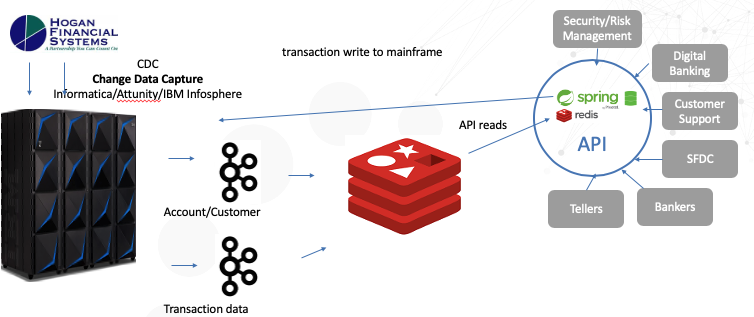
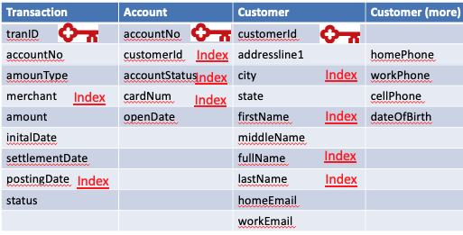

# Redisearch-Digital-Banking-redistemplate

Provides a quick-start example of using Redis with springBoot with Banking structures.  Digital Banking uses an API microservices approach to enable high speed requests for account, customer and transaction information.  As seen below, this data is useful for a variety of business purposes in the bank.
<a href="" rel="Digital Banking"></a>

### Note:  This is the same as Redisearch-Digital-Banking but uses redistemplate instead of any of the crudrepository indexes.  redisearch 2.0 indexes will be used.  This is not using the crudrepository for the basic redis data. 

## Overview
In this tutorial, a java spring boot application is run through a jar file to support typical API calls to a REDIS banking data layer.  A redis docker configuration is included.

## Redis Advantages for Digital Banking
 * Redis easily handles high write transaction volume
 * Redis has no tombstone issues and can upsert posted transactions over pending
 * Redis Enterprise scales vertically (large nodes)  and horizontally (many nodes)
 * Redisearch 2.0 automatically indexes the hash structure created by Spring Java CRUD repository

## Requirements
* Docker installed on your local system, see [Docker Installation Instructions](https://docs.docker.com/engine/installation/).
* Alternatively, can run Redis Enterprise and set the redis host and port in the application.properties file
* When using Docker for Mac or Docker for Windows, the default resources allocated to the linux VM running docker are 2GB RAM and 2 CPU's. Make sure to adjust these resources to meet the resource requirements for the containers you will be running. More information can be found here on adjusting the resources allocated to docker.

[Docker for mac](https://docs.docker.com/docker-for-mac/#advanced)
[Docker for windows](https://docs.docker.com/docker-for-windows/#advanced)

## Links that help!

 * [spring data for redis github](https://github.com/spring-projects/spring-data-examples/tree/master/redis/repositories)
 * [spring data for redis sample code](https://www.oodlestechnologies.com/blogs/Using-Redis-with-CrudRepository-in-Spring-Boot/)
 * [lettuce tips redis spring boot](https://www.bytepitch.com/blog/redis-integration-spring-boot/)
 * [spring data Reference in domain](https://github.com/spring-projects/spring-data-examples/blob/master/redis/repositories/src/main/java/example/springdata/redis/repositories/Person.java)
 * [spring data reference test code](https://github.com/spring-projects/spring-data-examples/blob/master/redis/repositories/src/test/java/example/springdata/redis/repositories/PersonRepositoryTests.java)
 * [spring async tips](https://dzone.com/articles/effective-advice-on-spring-async-part-1)
 * [brewdis sample application](https://github.com/redis-developer/brewdis)
 * [redis-developer lettucemod mesclun](https://github.com/redis-developer/lettucemod)


## Technical Overview

This github java code uses the mesclun library for redis modules.  The mesclun library supports RediSearch, RedisGears, and RedisTimeSeries.  The original github only used spring java without redisearch.  That repository is still intact at [this github location](https://github.com/jphaugla/Redis-Digital-Banking).  Another subsequent version uses crud repository and search at [this github location](https://github.com/jphaugla/Redisearch-Digital-Banking)
All of the Spring Java indexes have been removed in this version.  All the crud repository will also be removed in this when it is complete.
Can also use TLS with Spring Boot java lettuce.  Steps are near bottom.
### The spring java code
This is basic spring links
* [Spring Redis](https://docs.spring.io/spring-data/data-redis/docs/current/reference/html/#redis.repositories.indexes) 
* *boot*-Contains index creation for each of the four redisearch indexes used in this solution:  Account, Customer, Merchant, and Transaction
* *config*-Initial configuration module using autoconfiguration and a threadpool sizing to adjust based on machine size
* *controller*-http API call interfaces
* *data*-code to generate POC type of customer, account, and transaction code
* *domain*-has each of the java objects with their columns.  Enables all the getter/setter methods
* *repository*-has CRUD repository definitions.  With transition to redisearch 2.0, not used as heavily as previously.  This is where the redistemplate code is added if crud repository is no longer used.
* *service*-asyncservice and bankservice doing the interaction with redis
### 
The java code demonstrates common API actions with the data layer in REDIS.  The java spring Boot framework minimizes the amount of code to build and maintain this solution.  Maven is used to build the java code and the code is deployed to the tomcat server.

### Data Structures in use
<a href="" rel="Tables Structures Used"></a>

## Getting Started using Docker desktop
1. Prepare Docker environment-see the Prerequisites section above...
2. Pull this github into a directory
```bash
git clone https://github.com/jphaugla/Redisearch-Digital-Banking.git
```
3. Refer to the notes for redis Docker images used but don't get too bogged down as docker compose handles everything except for a few admin steps on tomcat.
 * [https://hub.docker.com/r/bitnami/redis/](https://hub.docker.com/r/bitnami/redis/)  
4. Open terminal and change to the github home where you will see the docker-compose.yml file, then: 
```bash
docker-compose up -d
```

## Getting Started without Docker on ubuntu

1. Install maven and java
```bash
sudo apt-get install maven
sudo apt-get install default-jdk
```
1. Pull this github into a directory
```bash
git clone https://github.com/jphaugla/Redisearch-Digital-Banking.git
```
1. edit ./src/main/resources/application.properties to change the redis host and the redis port number 

## Execute sample application 

1. Compile the code
```bash
mvn package
```
2.  run the jar file.   
```bash
java -jar target/redis-0.0.1-SNAPSHOT.jar
```
3.  Test the application from a separate terminal window.  This script uses an API call to generate sample banking customers, accounts and transactions.  It uses Spring ASYNC techniques to generate higher load.  A flag chooses between running the transactions pipelined in Redis or in normal non-pipelined method.
```bash
./scripts/generateData.sh
```
Shows a benchmark test run of  generateData.sh on GCP servers.  Although, this test run is using redisearch 1.0 code base.  Need to rerun this test.
<a href="" rel="Generate Data Benchmark"></a>

4.  Investigate the APIs in ./scripts.  Adding the redisearch queries behind each script here also...
  * addTag.sh - add a tag to a transaction.  Tags allow user to mark  transactions to be in a buckets such as Travel or Food for budgetary tracking purposes
  * deleteCustomer.sh - delete all customers matching a string
  * generateData.sh - simple API to generate default customer, accounts, merchants, phone numbers, emails and transactions
  * generateLots.sh - for server testing to generate higher load levels.  Use with startAppservers.sh.  Not for use with docker setup.  This is load testing with redis enterprise and client application running in same network in the cloud.
  * getByAccount.sh - find transactions for an account between a date range
  * getByCreditCard.sh - find transactions for a credit card  between a date range
  * getByCustID.sh - retrieve transactions for customer
  * getByEmail.sh - retrieve customer record using email address
  * getByMerchant.sh - find all transactions for an account from one merchant for date range
  * getByMerchantCategory.sh - find all transactions for an account from merchant category for date range
  * getByNamePhone.sh - get customers by phone and full name.
  * getByPhone.sh - get customers by phone only
  * getByStateCity.sh - get customers by city and state
  * getByZipLastname.sh -  get customers by zipcode and lastname.
  * getReturns.sh - get returned transactions count by reason code
  * getTags.sh - get all tags on an account
  * getTaggedAccountTransactions.sh - find transactions for an account with a particular tag
  * getTransaction.sh - get one transaction by its transaction ID
  * getTransactionStatus.sh - see count of transactions by account status of PENDING, AUTHORIZED, SETTLED
  * putCustomer.sh - put a set of json customer records
  * saveAccount.sh - save a sample account
  * saveCustomer.sh - save a sample customer
  * saveTransaction.sh - save a sample Transaction
  * startAppservers.sh - start multiple app server instances for load testing
  * testPipeline.sh - test pipelining
  * updateTransactionStatus.sh - generate new transactions to move all transactions from one transaction Status up to the next transaction status. Parameter is target status.  Can choose SETTLED or POSTED.  Will move 100,000 transactions per call

## TLS with spring boot java lettuce

Must set up the server side and verify server side Redis enterprise keys are working.  This guide
Really just a few steps to make this work and is not in the source code
[This blog helps with TLS configuration with Redis Enterprise](https://tgrall.github.io/blog/2020/01/02/how-to-use-ssl-slash-tls-with-redis-enterprise/)
Additional note, instead of using stunnel for testing redis-cli, see command after environment is established


* change environment variable to use redisson yaml file with SSL and have extra "s" on redis URI
```bash
export KEYSTORE_PASSWORD=sillyPassword
export TRUSTSTORE_PASSWORD=sillyPassword
export REDIS_CONNECTION="rediss://localhost:6379"
export REDISSON_YAML_PATH=src/main/resources/redisson-ssl.yaml
```
* generate required keys
    *  copy in proxy certificate into same ssl folder and name it proxy_cert.pem
```bash
cd src/main/resources/ssl
./generatepems.sh
# must type in passwords matching the environment variables when prompted below
./generatekeystore.sh
./generatetrust.sh
./importkey.sh
```
```bash
redis-cli -u $REDIS_CONNECTION --tls --cacert src/main/resources/ssl/proxy_cert.pem --cert src/main/resources/ssl/client_cert_app_001.pem --key  src/main/resources/ssl/client_key_app_001.pem -a $REDIS_PASSWORD
```

* Turn SSL on for the application.  (Two different ways)  in both ways, must set spring.redis.ssl to true
  * Can change src/main/resources/application.properties to add the key and trust store parameters
```bash
spring.redis.ssl=true
server.ssl.key-store=./src/main/resources/ssl/client-keystore.p12
server.ssl.key-store-password=${KEYSTORE_PASSWORD}
server.ssl.trust-store=./src/main/resources/ssl/client-truststore.p12
server.ssl.trust-store-password=${TRUSTSTORE_PASSWORD}
```
or can change the runtime (sample script included)
```bash

```
* package and run application
```bash
mvn clean package
java -jar  target/redis-0.0.1-SNAPSHOT.jar
```

WARNING:  This causes  TLS to be turned on for the application which causes the following chages:
* port changes from 8080 to 8443
* must disable the failure on non-certified key in each of the scripts. This format works:
```bash
*curl --insecure -I 
```